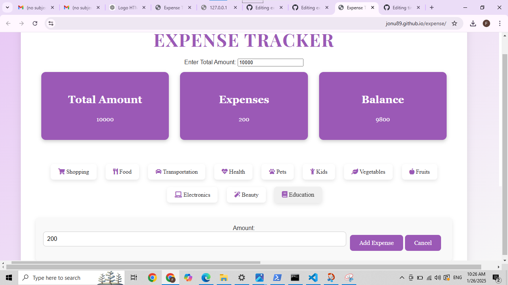
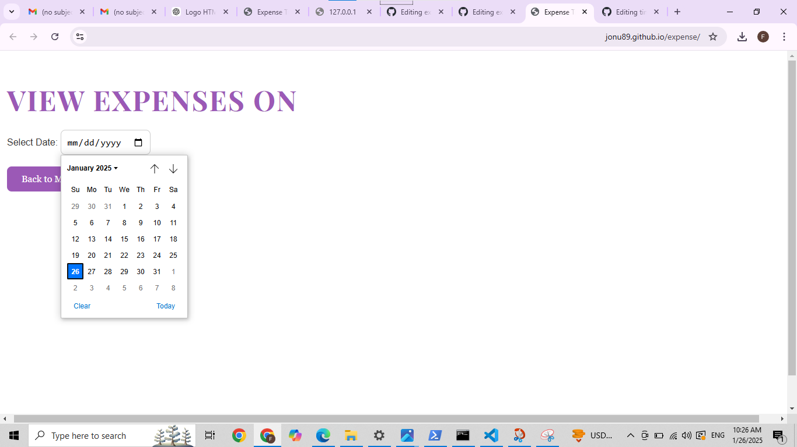
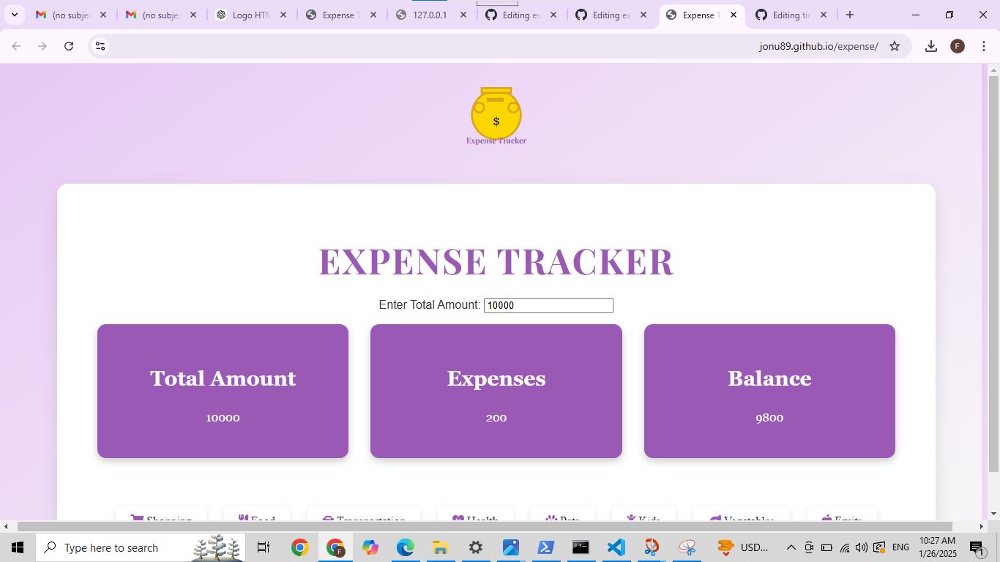

# EXPENSE TRACKER 🎯

## Basic Details
### Team Name: BUDDIES

### Team Members
- Member 1: JONU - VIDYA ACADEMY OF SCIENCE AND TECHNOLOGY
- Member 2: FATHIMA - VIDYA ACADEMY OF SCIENCE AND TECHNOLOGY
- Member 3: AYISHA - VIDYA ACADEMY OF SCIENCE AND TECHNOLOGY

### Hosted Project Link
https://jonu89.github.io/expense/

### Project Description
Hello everyone,our team name is buddies.Today we are excited to present our new project, the Expense tracker,which aims to simplify personal finance management by helping users keep track of their expenses and balance efficently

### The Problem statement
Many people struggle with managing their expenses and keeping track of their spending habits.Often this leads to overspendingng or difficulty in saving money.We wanted to adress this issue by creating a tool that helps users organises and track their financeses in an easy and visually appealing way.

### The Solution
The Expense Tracker is a web application that allows users to enter their total budget, track their spending across different categories, and calculate their remaining balance in real time. It’s simple, interactive, and designed to work seamlessly across devices.

## Technical Details
### Technologies/Components Used
For Software:
For Software:
- HTML, CSS, JS
- HTML, CSS, JS
- Font awesome, google fonts
- visual studio code,google chrome,chrome devtools

### Implementation
For Software:
# Installation
[commands]

# Run
[updateTotalAmount();
showExpenseForm('category_name');
addExpense();
cancelExpense();
viewExpensesByDate();
openSlide();
closeSlide();

### Project Documentation
For Software:

# Screenshots (Add at least 3)

# Diagrams

*Add caption explaining your workflow*

For Hardware:

# Schematic & Circuit

*Add caption explaining connections*

*Add caption explaining the schematic*

# Build Photos

*List out all components shown*

*Explain the build steps*

*Explain the final build*

### Project Demo
# Video
[Add your demo video link here]
*Explain what the video demonstrates*

# Additional Demos
[Add any extra demo materials/links]

## Team Contributions
- [Name 1]: [Specific contributions]
- [Name 2]: [Specific contributions]
- [Name 3]: [Specific contributions]

---
Made with ❤️ at TinkerHub
